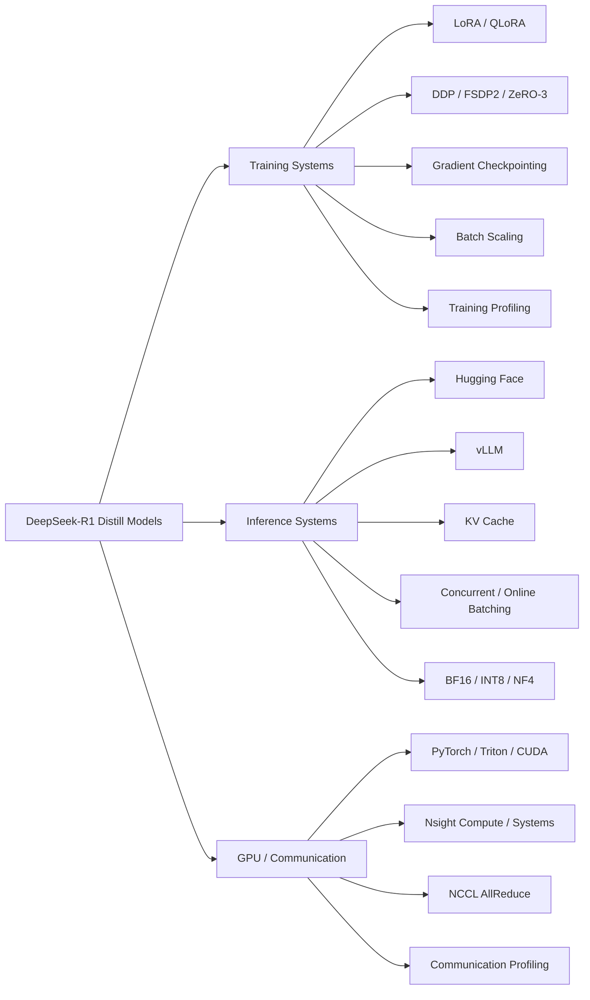

# DeepSeek-LLM-Systems-Lab

面向 **LLM Training / Inference Systems 与 AI Infra** 的可复现系统项目，覆盖参数高效训练、分布式训练框架、GPU Profiling、推理 Serving、KV Cache、动态 Batching、低精度训推，以及 Triton / CUDA 自定义 GPU Kernel。

本项目以：

- 本地 `DeepSeek-R1-Distill-Qwen-1.5B` + RTX 5060 Laptop GPU；
- 云端 `DeepSeek-R1-Distill-Qwen-7B` + `2 × NVIDIA A100-SXM4-80GB`

为主要实验环境，统一采用：

> **Baseline → Measure → Identify Bottleneck → Change One Variable → Re-measure → Explain Result**

的系统优化方法。

---

## 核心结果

### 训练 / 分布式系统（Training / Distributed Systems）

- **QLoRA 显存优化：** Peak VRAM 从 **4.66 GB 降至 2.91 GB**，代价是训练吞吐下降。
- **Profiling 驱动训练优化：** 关闭 Gradient Checkpointing 后，throughput 从 **126.76 提升至 162.31 tok/s（+28%）**，Peak VRAM 仅增加约 **0.07 GB**。
- **Kernel-level Training Profiling：** 一个受控 LoRA training step 共 **5,891 次 GPU kernel launch / 95.48 ms aggregate kernel time**，其中 **CUTLASS GEMM 占 53.9%**。
- **2×A100 DDP Weak Scaling：** throughput 从 **5,245.74 提升至 10,499.85 tok/s**，step time 基本不变（**195.21 → 195.05 ms**），约 **2.00× speedup / 100% weak-scaling efficiency**。
- **FSDP2 vs DDP：** 每卡 Peak Allocated Memory 从 **21.37 GB 降至 16.66 GB（-22.06%）**，但 throughput 下降 **32.17%**。
- **ZeRO-3 vs DDP：** 每卡 Peak Allocated Memory 降至 **16.92 GB（-20.85%）**，但 throughput 下降 **61.01%**。
- **FSDP2 优于当前 ZeRO-3 trade-off：** 在相近显存占用下，FSDP2 throughput 比 ZeRO-3 高 **73.98%**。

### 推理系统（Inference Systems）

- **vLLM Decode：** Decode Throughput 从 **43.58 提升至 78.16 tok/s**；主要收益来自 TPOT，而不是 TTFT。
- **KV Cache：** Decode Throughput 从 **32.67 提升至 47.03 tok/s（约 1.44×）**。
- **Serving Saturation：** Concurrent Batching 最高达到约 **5.66k output tok/s**，在 batch≈128 后进入明显 throughput-latency saturation。
- **Online Continuous Batching：** 128/128 请求成功，Output Throughput **1,934.83 tok/s**，TPOT P50/P90/P99 为 **23.01 / 24.87 / 25.98 ms**。
- **Quantization：** NF4 达到 **1.608 GB Peak VRAM / 62.37 tok/s**；当前 bitsandbytes INT8 路径虽然降低显存，但显著降低速度。

### GPU 算子 / 通信（GPU Kernel / Communication）

- **Triton RMSNorm：** 相比 PyTorch eager 最高达到 **19.6× speedup**。
- **Triton Fused Add + RMSNorm：** 相比 PyTorch unfused 最高达到 **20.5× speedup**。
- **Same-process Triton vs CUDA：** Triton 在 512 / 2048 tokens 下分别比当前 Native CUDA 实现快 **1.354× / 1.633×**。
- **NCCL AllReduce：** 256 MB payload 达到 **167.34 GB/s measured bus bandwidth**；64 MB 已达到最大实测值的 **90.46%**。
- **Communication Profiling：** DDP 每 step 约 **2 个 AllReduce kernels**；FSDP2 每 step 约 **57 个 AllGather + 28 个 ReduceScatter kernels**，并伴随额外 shard copy/split，直接体现 memory-saving 与 communication overhead 的系统权衡。

---

## 系统概览




---

# 1. 训练系统（Training Systems）

## 1.1 LoRA 与 QLoRA 训练对比

本地训练模型：`deepseek-ai/DeepSeek-R1-Distill-Qwen-1.5B`

主要 workload：

- BF16
- batch size = 1
- sequence length = 128
- LoRA `r=8, alpha=16`
- target modules = `q_proj`, `v_proj`

| Strategy | Avg. Step Time | Peak VRAM | Throughput | Train Loss |
|---|---:|---:|---:|---:|
| LoRA | 0.231 s | 4.659 GB | 127.43 tok/s | 5.955 |
| QLoRA（NF4） | 0.276 s | 2.906 GB | 106.50 tok/s | 5.905 |

QLoRA 显著降低 Peak VRAM，但量化开销使吞吐下降。

> **QLoRA 以额外计算开销换取显存容量，而不是直接带来训练加速。**

## 1.2 单 Rank 分布式框架验证（DDP / FSDP2 / DeepSpeed ZeRO）

在本地单 GPU 环境中，DDP / FSDP2 / DeepSpeed ZeRO 首先用于验证 process group、rank/device binding、sharding API、forward/backward、checkpoint/save-resume 与 framework overhead。

这些 `world_size=1` 结果不用于 multi-GPU scaling 结论。

| Strategy | Avg. Step Time | Peak VRAM | Throughput |
|---|---:|---:|---:|
| LoRA baseline | 0.231 s | 4.66 GB | 127.43 tok/s |
| FSDP2 (`world_size=1`) | 0.299 s | 5.53 GB | 98.19 tok/s |
| ZeRO-0 | 0.258 s | 3.42 GB | 112.93 tok/s |
| ZeRO-1 | 0.380 s | 4.29 GB | 76.77 tok/s |
| ZeRO-2 | 0.357 s | 4.29 GB | 81.73 tok/s |
| ZeRO-3 | 0.776 s | 4.34 GB | 37.55 tok/s |
| ZeRO-2 CPU Offload | 0.272 s | 4.28 GB | 107.24 tok/s |

单 rank 下，更高 sharding stage 没有真实跨卡 state partition 收益，却仍承担额外 bookkeeping / communication machinery。

## 1.3 基于 Profiling 的训练优化

PyTorch Profiler CUDA activities 在当前 RTX 5060 Laptop + WSL2 环境中触发 `CUPTI_ERROR_INVALID_DEVICE`。随后 Nsight Systems 2024.6.2 同样失败；升级到 Nsight Systems 2026.4.1 后可以采集 CUDA API / NVTX，但仍无法提供可靠 GPU kernel timeline；最终切换到 Nsight Compute 2026.2 完成 kernel-level profiling。

| Category | GPU Time | Share |
|---|---:|---:|
| CUTLASS GEMM | 51.48 ms | 53.9% |
| Copy / cast | 27.57 ms | 28.9% |
| Other elementwise | 10.49 ms | 11.0% |
| FlashAttention | 1.42 ms | 1.49% |
| Other | ~4.52 ms | ~4.7% |
| **Total** | **95.48 ms** | **100%** |

总 kernel launch：**5,891**。

Profiler 同时观察到 Gradient Checkpointing 引起的 forward recomputation，随后只改变一个变量：关闭 GC。

| Metric | GC On | GC Off | Change |
|---|---:|---:|---:|
| Avg. Step Time | 0.232 s | 0.181 s | -22.0% |
| Throughput | 126.76 tok/s | 162.31 tok/s | +28.0% |
| Peak VRAM | 4.66 GB | 4.73 GB | +0.07 GB |

在当前 `1.5B / batch=1 / seq=128` workload 下，recomputation 成本明显高于其带来的少量 activation-memory 节省。

## 1.4 Batch Size 扩展与吞吐变化（Batch Scaling）

| Batch Size | Throughput |
|---:|---:|
| 1 | 162.31 tok/s |
| 2 | 261.96 tok/s |
| 4 | 516.04 tok/s |
| 8 | 823.29 tok/s |

batch=1 明显没有充分利用 GPU；随着 batch size 增大，throughput 快速提高，同时在较大 batch 下逐渐出现次线性扩展。


---

# 2. 双 A100 真实多 GPU 训练

Phase 6 在真实云端双 GPU 环境完成。

## 2.1 实验环境与统一训练工作负载

| Item | Configuration |
|---|---|
| GPU | 2 × NVIDIA A100-SXM4-80GB |
| GPU Interconnect | NV12 |
| Model | `deepseek-ai/DeepSeek-R1-Distill-Qwen-7B` |
| Precision | BF16 |
| Attention | PyTorch SDPA |
| LoRA | r=8, alpha=16, q_proj / v_proj |
| Per-device Batch | 2 |
| Sequence Length | 512 |
| Optimizer | AdamW |
| Learning Rate | 1e-4 |
| Warmup | 3 steps |
| Timed Benchmark | 10 steps |
| PyTorch | 2.8.0+cu128 |
| CUDA Runtime | 12.8 |
| NCCL | 2.27.3 |

训练 benchmark 使用固定 synthetic token batch，以减少数据读取差异并聚焦训练系统本身。显存采用 `torch.cuda.max_memory_allocated()`，因此下文的 Peak Memory 指 **PyTorch Peak Allocated CUDA Memory**。

## 2.2 DDP 1→2 GPU 弱扩展（Weak Scaling）

保持每 GPU batch size = 2、sequence length = 512 不变。

| GPUs | Global Batch | Avg. Step | Throughput | Peak Allocated / GPU |
|---:|---:|---:|---:|---:|
| 1 | 2 | 195.206 ms | 5,245.74 tok/s | 21.372 GB |
| 2 | 4 | 195.050 ms | 10,499.85 tok/s | 21.372 GB |

- Throughput speedup：**2.0016×**
- Weak-scaling efficiency：**100.08%**
- Step time change：约 **-0.08%**

正式结论：

> DDP achieved approximately **2.00× throughput** and approximately **100% weak-scaling efficiency** from one to two A100 GPUs.

`100.08%` 属于短 benchmark 中合理的测量波动，不解释为稳定的 superlinear scaling。

## 2.3 DDP / FSDP2 / ZeRO-3 分布式策略对比

| Strategy | Avg. Step | Throughput | Peak Allocated / GPU |
|---|---:|---:|---:|
| DDP LoRA | 195.050 ms | 10,499.85 tok/s | 21.372 GB |
| FSDP2 LoRA | 287.543 ms | 7,122.41 tok/s | 16.659 GB |
| DeepSpeed ZeRO-3 LoRA | 500.257 ms | 4,093.90 tok/s | 16.917 GB |

相对 DDP：

| Strategy | Throughput Change | Step Time Change | Memory Saved | Memory Reduction |
|---|---:|---:|---:|---:|
| FSDP2 | -32.17% | +47.42% | 4.714 GB | 22.06% |
| ZeRO-3 | -61.01% | +156.48% | 4.456 GB | 20.85% |

当前 workload 下：

- **DDP：** 最高吞吐 / 最高每卡显存
- **FSDP2：** 中等吞吐 / 最低每卡显存 / 最佳 memory-throughput balance
- **ZeRO-3：** 最低吞吐 / 与 FSDP2 相近显存

FSDP2 相比 ZeRO-3：

- throughput 高 **73.98%**
- step time 低 **42.52%**
- Peak Allocated Memory 还低约 **0.258 GB**

这并不意味着 FSDP2 或 ZeRO-3“不适合大模型训练”。当前 7B LoRA workload 可以轻松容纳在单张 80 GB A100 上，因此 sharding 的容量收益不是运行的必要条件，额外 collective / parameter materialization / framework overhead 反而更加明显。


---

# 3. 通信系统（Communication Systems）

## 3.1 NCCL AllReduce 通信基准

实验设置：

- world size = 2
- FP32
- payload = 1 / 4 / 16 / 64 / 256 MB
- warmup = 5
- benchmark = 20
- AllReduce SUM correctness check

| Payload | Avg. Latency | Algorithm BW | Bus BW |
|---:|---:|---:|---:|
| 1 MB | 0.0960 ms | 10.92 GB/s | 10.92 GB/s |
| 4 MB | 0.0935 ms | 44.84 GB/s | 44.84 GB/s |
| 16 MB | 0.1568 ms | 107.01 GB/s | 107.01 GB/s |
| 64 MB | 0.4433 ms | 151.38 GB/s | 151.38 GB/s |
| 256 MB | 1.6041 ms | 167.34 GB/s | 167.34 GB/s |

由于 `world_size=2`，AllReduce bus-bandwidth 换算系数 `2 × (world_size - 1) / world_size` 正好等于 1，因此 algorithm BW 与 bus BW 数值相同。

结果展示典型的：

> **small-message latency-bound → large-message bandwidth-bound**

转换。64 MB 已达到 256 MB 最大实测 bandwidth 的约 **90.46%**。

## 3.2 DDP 与 FSDP2 通信 Profiling

Profiler 与 clean benchmark 分开运行，只用于观察 collective 类型和次数、rank arrival skew、shard copy/split，以及 communication 与 compute 的结构关系。

### DDP

3 个 profiled steps 中，每 rank：

- **6 × AllReduce GPU kernels**
- 即约 **2 AllReduce kernels / step**

DDP 主要同步少量 LoRA gradient buckets。

Profiler 还观察到 rank arrival skew，因此单 rank 的长 NCCL kernel duration 可能包含等待另一 rank 到达 collective 的时间，不能直接解释成纯 NVLink transfer latency。

### FSDP2

每 rank 3 个 profiled steps：

| Collective | Count | Per Step |
|---|---:|---:|
| AllGather | 171 | 57 |
| ReduceScatter | 84 | 28 |

同时还存在明显的 shard copy/split / materialization 工作。

| Metric | DDP | FSDP2 | Change |
|---|---:|---:|---:|
| GPU kernel events | 12,378 | 14,634 | +18.2% |
| `cudaLaunchKernel` events | 12,201 | 14,211 | +16.5% |

因此 FSDP2 的核心 trade-off 可以直接观察为：

> **更低的 per-GPU memory ↔ 更频繁的 parameter AllGather / gradient ReduceScatter / shard materialization**

这为 clean benchmark 中 DDP 与 FSDP2 的吞吐差异提供了直接通信结构证据。


---

# 4. 推理系统（Inference Systems）

## 4.1 Hugging Face 与 vLLM 推理性能对比

| Runtime | TTFT | TPOT | Decode Throughput | E2E Latency |
|---|---:|---:|---:|---:|
| Hugging Face | 23.41 ms | 23.04 ms/token | 43.58 tok/s | 2.949 s |
| vLLM | 30.74 ms | 12.79 ms/token | 78.16 tok/s | 1.656 s |

在该短 prompt workload 中，vLLM 没有改善 TTFT，其主要优势来自 **更低 TPOT / 更快 Decode Path**。

## 4.2 KV Cache 缓存效果

| Mode | TTFT | TPOT | Decode Throughput | E2E | Peak VRAM |
|---|---:|---:|---:|---:|---:|
| KV Cache ON | 25.14 ms | 21.37 ms | 47.03 tok/s | 2.740 s | 3.35 GB |
| KV Cache OFF | 27.11 ms | 30.67 ms | 32.67 tok/s | 3.922 s | 3.42 GB |

KV Cache 将 Decode Throughput 提升约 **1.44×**。该短序列实验聚焦 ON/OFF decode behavior，不用于刻画长 context KV-memory scaling。

## 4.3 并发批处理（Concurrent Batching）

| Batch | Output Throughput |
|---:|---:|
| 1 | 92.27 tok/s |
| 2 | 186.74 tok/s |
| 4 | 370.01 tok/s |
| 8 | 724.96 tok/s |
| 16 | 1,371.04 tok/s |
| 32 | 2,512.03 tok/s |
| 64 | 4,334.65 tok/s |
| 128 | 5,347.19 tok/s |
| 256 | 5,659.32 tok/s |

batch≈128 后 throughput 增益明显下降、TPOT 开始快速上升。真实 serving 目标不应只是最大 tokens/s，而应寻找 **Throughput–Latency Operating Point**。

## 4.4 在线连续批处理（Online Continuous Batching）

使用 `vllm serve + vllm bench serve` 构造 variable-length Poisson arrivals。

- Requests：**128 / 128 successful**
- Configured Request Rate：**32 RPS**
- Max Concurrency：**64**
- Request Throughput：**14.43 req/s**
- Output Throughput：**1,934.83 tok/s**
- Total Throughput：**2,868.32 tok/s**
- TTFT P50 / P90 / P99：**81.56 / 131.73 / 174.81 ms**
- TPOT P50 / P90 / P99：**23.01 / 24.87 / 25.98 ms**

Online benchmark 用于观察动态 request arrival / scheduler behavior，与 simultaneous batching saturation experiment 分开分析。

## 4.5 低精度推理（BF16 / INT8 / NF4）

| Mode | Peak VRAM | TTFT | TPOT | Decode Throughput | E2E |
|---|---:|---:|---:|---:|---:|
| BF16 | 3.346 GB | 21.99 ms | 19.33 ms | 52.05 tok/s | 2.476 s |
| bitsandbytes INT8 | 2.139 GB | 130.66 ms | 89.77 ms | 11.14 tok/s | 11.532 s |
| NF4 4-bit | 1.608 GB | 20.00 ms | 16.10 ms | 62.37 tok/s | 2.065 s |

结果表明：**更低 bit width 并不自动意味着更高速度。**

当前 backend 下，INT8 降低显存但性能显著下降；NF4 同时获得更低显存和更高 Decode Throughput。

本实验未执行 downstream quality / perplexity evaluation，因此只讨论 **Memory–Performance Trade-off**。


---

# 5. GPU 算子优化（GPU Kernel Optimization）

## 5.1 PyTorch 与 Triton RMSNorm 性能对比

| Tokens | PyTorch | Triton | Speedup |
|---:|---:|---:|---:|
| 1 | 43.646 μs | 7.145 μs | 6.1× |
| 16 | 43.670 μs | 6.829 μs | 6.4× |
| 128 | 94.708 μs | 7.348 μs | 12.9× |
| 512 | 76.813 μs | 8.943 μs | 8.6× |
| 2048 | 262.165 μs | 13.405 μs | 19.6× |

Triton 将 reduction、rsqrt、scaling、weight multiply 融合进单 kernel，减少 eager execution 中的多 kernel launch 和 intermediate tensor overhead。

## 5.2 融合算子：Fused Add + RMSNorm

| Tokens | PyTorch Unfused | Triton Fused | Speedup |
|---:|---:|---:|---:|
| 1 | 51.449 μs | 7.192 μs | 7.15× |
| 16 | 51.328 μs | 7.234 μs | 7.10× |
| 128 | 61.848 μs | 7.523 μs | 8.22× |
| 512 | 132.753 μs | 15.072 μs | 8.81× |
| 2048 | 414.225 μs | 20.208 μs | 20.50× |

Fusion 的收益不仅来自减少 launch，还来自避免 `x + residual` 中间 tensor 的 global-memory materialization。

## 5.3 Triton 与 Native CUDA 算子对比

最终使用同一 Python process、同一 GPU/tensor、双方 warmup、20 rounds、每轮各 100 次，并交替 CUDA→Triton / Triton→CUDA。

| Tokens | CUDA Median | Triton Median | Triton Speedup | Triton Wins |
|---:|---:|---:|---:|---:|
| 512 | 11.131 μs | 8.219 μs | 1.354× | 20/20 |
| 2048 | 37.720 μs | 23.094 μs | 1.633× | 20/20 |

Nsight Compute 排除了 register spilling 和 occupancy collapse 作为主要原因。

更强的证据包括：

- Triton global-load requests 约少 **8×**
- Triton DRAM throughput 更高
- Triton shared-memory footprint 更小
- CUDA shared-memory tree reduction 需要更多同步

因此当前差距更符合 **Memory Instruction Efficiency + Reduction Strategy** 的差异。

结论严格限定于：**当前 CUDA implementation × Triton implementation × GPU / workload**。


---

# 6. Profiling 在系统优化中的作用

本项目中的 Profiler 不用于“装饰 benchmark”，而是用于提出、验证或否定系统性能假设。

### Training

```text
Forward recomputation observed
→ Hypothesis: Gradient Checkpointing overhead
→ Disable GC
→ Clean benchmark
→ +28% throughput with +0.07 GB Peak VRAM
```

### GPU Kernel

```text
CUDA slower than Triton
→ Initial hypothesis: registers / occupancy
→ Nsight Compute
→ Hypothesis rejected
→ Evidence points to memory instructions / reduction path
```

### Distributed Training

```text
FSDP2 saves memory but loses throughput
→ Communication profiler
→ 57 AllGather + 28 ReduceScatter / step
→ Additional shard copy/split
→ Direct structural explanation for runtime overhead
```

---

# 7. 可复现性（Reproducibility）

主要实验入口：

```bash
bash scripts/run_phase1.sh
bash scripts/run_phase2.sh
bash scripts/run_phase3.sh --help
bash scripts/run_phase4.sh
bash scripts/run_phase5.sh
```

Phase 6 云端入口与正式结果位于：

```text
training/phase6_ddp_lora.py
training/phase6_fsdp2_lora.py
training/phase6_zero3_lora.py
training/phase6_profile.py

results/training/phase6_ddp_scaling.csv
results/training/phase6_strategy_comparison.csv
results/training/phase6_nccl_allreduce.csv
results/training/phase6_profiles/
```

正式结果采用 CSV / JSON benchmark output、Nsight `.ncu-rep`、PyTorch Profiler trace 保存。README 中的主要数字均可回溯至仓库中的正式结果文件。

---

# 8. 仓库结构（Repository Structure）

```text
DeepSeek-LLM-Systems-Lab/
├── configs/
├── datasets/
├── training/
├── inference/
├── kernels/
│   ├── pytorch/
│   ├── triton/
│   └── cuda/
├── results/
│   ├── training/
│   ├── inference/
│   ├── kernels/
│   └── profiler/
├── scripts/
├── Dockerfile
├── docker-compose.yml
└── README.md
```

---

# 9. 工程结论（Engineering Conclusions）

### 1. 显存优化通常会把开销转移到其他路径

- QLoRA：显存下降，但 throughput 下降；
- Gradient Checkpointing：节省 activation memory，但增加 recomputation；
- FSDP2 / ZeRO-3：每卡显存下降，但 communication / materialization 增加；
- INT8：权重显存下降，但当前 backend 的 execution overhead 明显增加。

### 2. Throughput 需要结合 Latency 共同评估

Concurrent Batching 可以把 aggregate throughput 提升到约 5.66k tok/s，但 saturation 后 TPOT 快速恶化。

### 3. Backend 名称不能直接预测性能

- vLLM 的 TTFT 不一定比 HF 更好；
- INT8 不一定比 BF16 / NF4 更快；
- 高 occupancy 不意味着 kernel 已经最优；
- FSDP2 / ZeRO-3 不会因为“更高级的 sharding”自动获得更高 throughput。

### 4. 分布式策略依赖具体 Workload

在本次 `7B LoRA / batch 2 per GPU / seq 512 / 2×A100 NV12` workload 中：

- DDP 提供最高吞吐并实现约 2.00× weak scaling；
- FSDP2 用约 32% throughput 损失换取约 22% per-GPU memory reduction；
- ZeRO-3 提供相近显存节省，但当前 runtime cost 更高。

当模型或 batch 大到 DDP 无法容纳时，sharded training 的 capacity benefit 会变得更加重要。


---

# 10. 实验范围与适用边界（Scope）

当前主要实验覆盖：

### 本地实验（Local）

- RTX 5060 Laptop GPU
- DeepSeek-R1-Distill-Qwen-1.5B
- LoRA / QLoRA
- GPU Profiling
- vLLM / KV Cache / Batching
- Quantization
- Triton / CUDA Kernel

### 云端多 GPU 实验（Cloud）

- Single node
- 2 × A100-SXM4-80GB
- DeepSeek-R1-Distill-Qwen-7B LoRA
- DDP weak scaling
- FSDP2 / ZeRO-3
- NCCL AllReduce
- Communication Profiling

当前没有将结果泛化到：

- 4 / 8+ GPU scaling
- multi-node training
- strong scaling
- MoE / Tensor Parallel / Pipeline Parallel
- RL training systems
- multimodal training
- RDMA programming

这些未覆盖方向不影响当前实验结论，但不在本项目现有证据范围内。

---

# 11. 技术报告（Technical Report）

项目配套完整中文技术报告，包含：

- 实验环境与方法；
- 训练 / 推理 benchmark；
- GPU Profiling；
- 多 GPU DDP / FSDP2 / ZeRO-3；
- NCCL 与 communication trace；
- Triton / CUDA Kernel；
- 结果适用范围与工程结论。

建议在仓库中提供：

```text
docs/DeepSeek_LLM_Systems_Lab_Technical_Report_CN.pdf
```

并在此处添加正式 PDF 链接。

---

# 核心结论（Key Takeaway）

> **LLM 系统性能不是由“框架名称”决定，而是由具体 Hardware × Software × Workload 下的主导瓶颈决定。**

本项目通过 training、serving、GPU kernel 与 distributed communication 四个层面的受控 benchmark 和 profiler evidence 展示了同一个工程规律：

> **先建立可比较的 baseline，再定位真正瓶颈；优化之后必须同时验证 throughput、latency、memory 与系统开销，而不能仅根据技术标签判断性能。**
